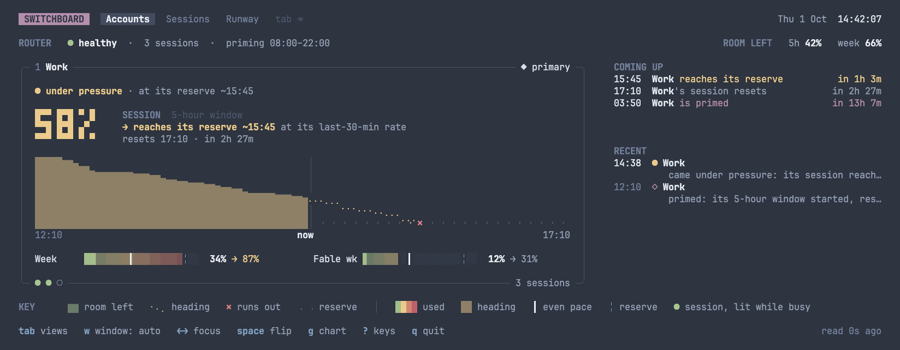
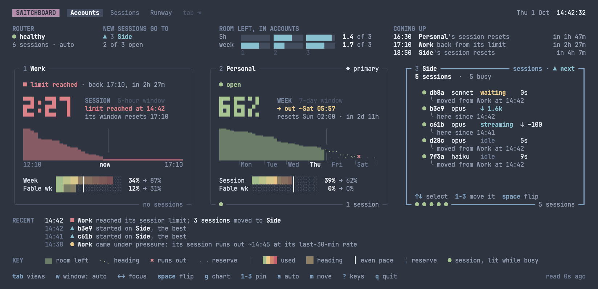
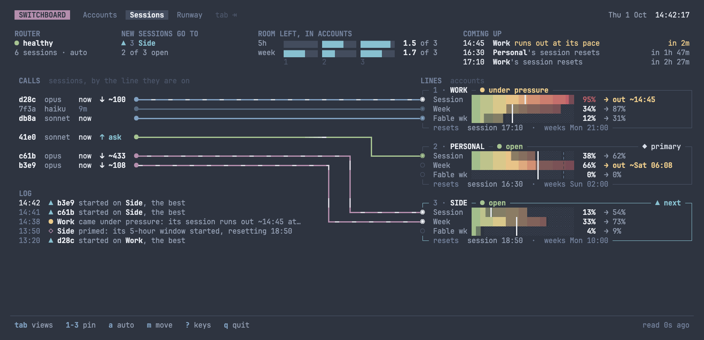
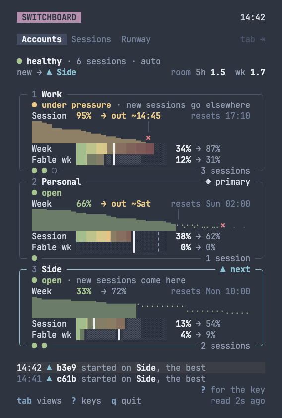
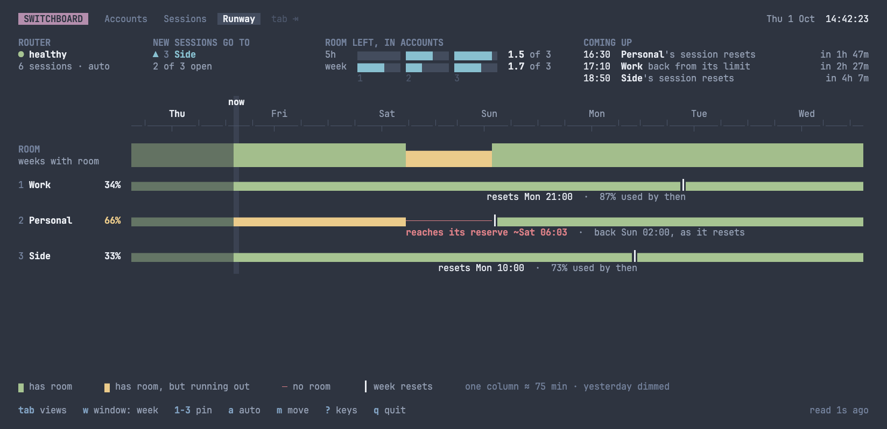
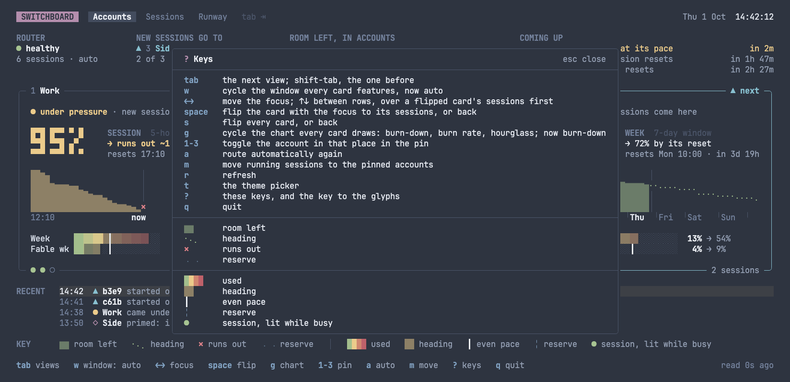
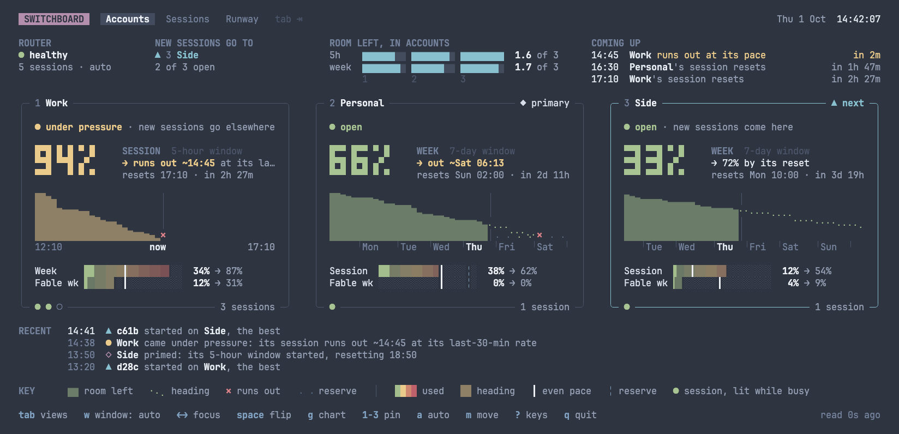

<div align="center">

# 🎛️ Switchboard

**Your Claude usage, tracked, and routed across your subscriptions**

A local router for Claude Code that tracks, routes and analyses
<br>your Claude usage across one or more accounts.

[](LICENSE)
[](https://go.dev)
[](#install)

[Install](#install) · [Quick Start](#quick-start) · [How It Works](#how-it-works) · [Commands](#commands) · [Configuration](#configuration) · [Dashboard](#the-dashboard)

<br>


</div>

---

Every Claude subscription has usage limits, per 5 hours and per week. Hit one mid-task and Claude Code stops until it resets. `/usage` says where you stand when you think to ask, but not where you're heading, when you'll run out, or when you'll have room again, and Claude can't see any of it.

Run several subscriptions and there's a routine on top: watch the limits, notice one has run out, exit Claude Code, switch accounts, resume, and rebuild the prompt cache from cold. Meanwhile the weekly quota you didn't get round to before its reset is lost.

## Why Switchboard?

- **Your usage, always in view.** `switchboard usage -w` keeps every window on screen: how much is left, when it runs out at your pace, when it resets, and when you'll have room again, over the day or the week, charted from a history it keeps. It reads usage off the answers your sessions already get, so watching costs next to nothing.
- **Told in time.** Desktop notifications when a window passes a share you choose, when an account hits a limit, and when it has room again.
- **Claude knows too.** A skill tells Claude Code about switchboard, so Claude reads every account's usage itself (`switchboard status --json`), and can plan around a limit, or pin and move sessions when you ask.
- **Limits stop interrupting you.** With several subscriptions, a request that hits a limit is replayed on another account before Claude Code sees any of the answer. You get one slower turn while the cache rebuilds there, then the session carries on: no exiting, no resuming.
- **Sessions stay put.** Prompt caches are per account, and the first turn after a move costs around 40× a warm one. A session stays on its account while its cache is warm, and moves only when it must, or once it has idled long enough that its cache is cold anyway.
- **No quota goes to waste.** New sessions go to the account whose weekly quota would be lost soonest unused: the share left, divided by the time until it resets. Between near equals, the one whose 5-hour window resets soonest goes first, as what's left in a window at its reset is lost too.
- **Resets come one at a time.** Priming starts the accounts' 5-hour windows at staggered times, so once all are spent, the next is back within 5 hours ÷ the number of accounts, rather than at the one reset they'd share.
- **Never in the way.** When the router isn't running, `claude` connects directly; when switchboard can't take part at all, `claude` starts as it would without it.

Switchboard is built for its author's setup: macOS, Claude Code, and a Claude subscription or several. It's public because it can be, and general only where that costs nothing.

## Install

You'll need macOS, Claude Code, and a long-lived token for each subscription, made with `claude setup-token` while signed in to it. `switchboard setup` asks for the tokens.

**Homebrew**

```bash
brew install leeovery/tools/switchboard
```

**From source**

```bash
go install github.com/leeovery/switchboard/cmd/switchboard@latest
```

## Quick Start

```bash
brew install leeovery/tools/switchboard
switchboard setup       # accounts and their tokens, priming, the service, the claude link, the skill
claude                  # Claude Code, through switchboard
switchboard usage -w    # every account's usage, live
```

`setup` walks through the rest a step at a time, and is safe to run again: each step says what's done already, and does only what isn't. It asks for each account's id, label and token, which account is the primary, and your day for priming; installs the service that keeps the router running; links `claude` to switchboard, and gives you the one line to add to your shell's startup file; and installs a Claude Code skill that tells Claude what switchboard does. See [`setup`](#setup).

## How It Works

```
Claude Code ──ANTHROPIC_BASE_URL──▶ switchboard ──▶ api.anthropic.com
                                      │
                                      ├─ chooses the account: sticky per session and model
                                      ├─ swaps in that account's token
                                      └─ reads every response's usage headers
```

- **Every `claude` goes through switchboard.** `setup` puts a link named `claude` in switchboard's own bin directory, which you put on `PATH` ahead of the real one. Run by that name, switchboard starts the real Claude Code connected to the router: from a shell, a tmux pane, a script, or a tool that runs `claude -p`.
- **A token swapped, the body untouched.** Switchboard replaces the `Authorization` header of each conversation request (`/v1/messages` and its `count_tokens`) with the chosen account's token, and never edits a request's body, so the request is still Claude Code's own, and Claude's thinking stays valid from turn to turn. It narrows the request's `Accept-Encoding` to gzip, deflate and identity, the encodings it can read a copy of the answer in, to count the answer as it streams. Everything else passes through on Claude Code's own token, as it came. Either way, every header of switchboard's own, named `X-Switchboard-…`, is taken off on the way, so the API never sees one: the pin `run --account` sets, the directory `run` names for the ledger, and any a newer `run` sends.
- **Usage off real traffic.** Every response carries each window's utilization and reset: the 5-hour window, the weekly window every model shares, and a model's own weekly window where it has one. Only a 429 that refuses the request itself carries none. Switchboard reads them off every response, and probes an account, one request per model family, each capped at one output token, only when nothing has been read of it, a decision needs fresher numbers than traffic has given, a dashboard asks, or it's due a [prime](#priming).
- **Choosing an account.** A new session goes to the account whose quota most needs using, among those with room in every window its model counts against: the room left in the shared weekly window, divided by the hours until it resets. So quota that resets tomorrow is used before quota that resets next week, and an account with little left scores low unless its week resets soon. Among accounts scoring at least 0.8 of the best, the one whose 5-hour window resets soonest wins, as what's left in a window at its reset is lost; with [priming](#priming), the accounts' resets are spread through the day.
- **Pressure.** Several busy sessions on one account run its 5-hour window out together, then all move at once, each rebuilding its cache elsewhere. So the router watches each account's 5-hour window: at the rate its use rose over the last 30 minutes, or across a longer gap in its readings, spread over the gap, as use outside the router shows only when the router next reads the account, so an account gone quiet reads quiet (its use since it started, for a window with no reading from 10 minutes back), an account whose window reaches its reserve, or its limit without one or on an account pinned, before it resets is under pressure, and a new session, a request without one, or a session chosen afresh after an idle hour, because its account can't serve it or because its own pin yields, goes to the best of the others, the pin's first. Running sessions stay put, a session's own pin holds, and when every account is under pressure, it changes nothing.
- **Sticky, for the cache.** A session is remembered by its session id and model once a request of it is answered with success, so a resumed session finds its account again, and a request under an id never used again that fails, as the quota check `claude --resume` sends as it starts can, leaves nothing behind. It stays on that account while its cache is warm, for an hour after its last request, and the account has room. Idle past the hour, its cache is cold and a move costs nothing, so it's re-scored, keeping its own account unless another beats it by 20%. A Claude Sonnet 5.5 session isn't re-scored for idling: its thinking works only on the account that produced it, and a move would lose it.
- **Limits and replay.** A 429 that says a limit is reached is replayed on the next candidate before any of the answer reaches Claude Code, and the session moves there and stays; the account sits out of the requests the limit counts, so a limit on Fable's own week leaves its other models' sessions where they are, until the reset the 429 gives, or for five minutes when it gives none, or sooner when a request sent since shows it lifted, as after you reset a limit by hand. A 429 that's only throttling waits and retries on the same account, twice at most, as moving would throw the cache away for nothing. A 429 without usage headers says nothing of the account, but refuses the request itself, so it reaches Claude Code at once, as it came. A request the API refuses is replayed elsewhere too, and the refusal never relayed, as Claude Code drops its login on a 403. An account whose token the API refuses sits out every request for ten minutes, and one that refuses the request itself sits out that model's requests as long, unless every account the request went out on refused it, which says more of the request than of the accounts, so none sits out for it, and its session stays where it was. When no account has room, Claude Code gets a 429, as it would from one account at its limit; when every account has refused the request, a 502 that gives the API's reason and tells it not to retry.
- **Pins.** `switchboard pin` sends new sessions to one account, or to the best of several, or moves running ones there; `pin --session` pins one running session; `switchboard run --account` pins a session as it starts. Every pin yields at a limit rather than failing. See [`pin`](#pin).
- **State that outlasts restarts.** The router keeps each session's account, the pins and each account's last readings in `state.json`, so a restart doesn't scatter sessions or need a probe.
- **A readings history.** The router appends each reading that changes how a window of an account reads, and nothing when nothing moved, to a file a day in the state directory's `history/`, kept for 400 days, or as long as [`[history]`](#history-keys) says, `forever` included: a JSON line each, `{"at", "account", "window", "utilization", "resets_at", "status", "source"}`, `source` saying whether it came off an answer, a probe or a prime, and the account by its id alone. It's there for you to look back at how the accounts were used; fields may be added to a line, never renamed. A day's file, `readings-<date>.jsonl`, is compressed to `readings-<date>.jsonl.gz`, which `gzip -dc` reads, once its day ended two days ago. As it starts, the router takes up the readings of its two newest days, so the recent rates outlast a restart. It never stands in routing's way: a line it can't write goes unwritten, logged once.
- **A request ledger.** The router appends a line for each request it routes, as it finishes with it, whether it went upstream or the router answered it itself, to a file a day in the state directory's `ledger/`, kept for 400 days, or as long as [`[ledger]`](#ledger-keys) says, `forever` included: a JSON line each, `{"at", "request", "kind", "session", "dir", "model", "account", "reason", "from", "tried", "status", "canceled", "cut_off", "attempts", "first_ms", "total_ms", "agent", "betas", "prompt", "class", "agent_id", "parent_agent_id", "agent_type", "compaction", "compacted", "tool_ms", "shape", "answer", "usage", "limits"}`, `request` the router's id for it, as its routed line in the log gives it, `kind` saying whether it was a message, Claude Code's quota check or a count of tokens, `dir` the directory `run` started Claude Code in, your home shown as `~`, which `run` tells the router in a header the API never sees, and which a `claude` started within that session other than through `run` carries too, `account` the account whose answer the client got, by its id alone, `canceled` set where the client went away before the end, `cut_off` where the router cut the request off as it stopped, `prompt` to `tool_ms` what Claude Code's own headers say of the request, each left out where it sends none: the prompt it serves, by Claude Code's random id, the same on every request of one prompt, its subagents' included; its class, `main`, `subagent`, `workflow`, `compaction` or `auxiliary`; the subagent that sent it, and the one that started that, by Claude Code's ids for them, random for a subagent, from its name for a member of an agent team; the subagent's kind, a built-in agent's name, `custom`, `teammate` or `fork`, never a name you chose; what started a compaction; and how long each tool call whose result it carries ran; the agents' ids Claude Code sends the router always, and the rest as `run` has it send them, and `shape` the request's size, how many messages, system blocks and tools it carried, and those of its settings switchboard knows: `max_tokens`, `thinking`, `stream`, `tool_choice`'s type, `temperature`, `top_k`, `top_p`, `service_tier`, `output_config`'s `effort`, `speed`, `inference_geo`, and the types of `context_management`'s edits. Of the answer the client got, `answer` holds Anthropic's id for it, the model that served it, why it stopped, how many blocks of each kind it held, the tools it called, by name, and an error's type and message; `usage` its closing usage, as the API gave it, field for field; and `limits` its `anthropic-ratelimit-unified-*` headers, the prefix taken off. It keeps everything about a request but its content: never its messages, its system prompt or its tools, its metadata's ids, a setting or header the line doesn't name, or anything shaped like a token. Fields may be added to a line, never renamed. A day's file, `requests-<date>.jsonl`, is compressed to `requests-<date>.jsonl.gz` once its day ended two days ago, as the history's are. It never holds a request up: the lines wait, 8,192 at most, for a goroutine of their own to write them, and a line it can't write goes unwritten, logged once. An hour after each day ends, giving the requests still in flight then time to end, the router summarises it beside its lines, in `day-<date>.json`: `{"version", "day", "lines", "bytes", "accounts"}`, how many lines it was made from, and how large its files were then, then each account's requests by model, counted by how each went, those that went upstream but got no usage back among them, with their sessions and their usage summed field for field, and of the account as a whole its sessions, by their ids too, those moved onto it and off it, each window's highest use that day, its rise and its resets, with the use before each, from the history, the minutes it spent at its cap and at a limit, the limits it reached, each a window turning `rejected`, and the windows the history read in the week before. A day that ended while the router was stopped is summarised as it starts again, before the history's readings of it can go, and a day a line comes to be filed under later, as a request in flight past that hour files one, is summarised again, knowing no less than before, though the history has since let the day's readings go, or a damaged file some of its lines, which can't be told from those filed since, so its counts are then the least there were; once its lines go, its summary is kept for good. [`requests`](#requests) and [`history`](#history) read it all back, with or without the router. Beside the lines, in `events-<date>.jsonl`, kept as long and compressed as they are, the router files its events, a JSON line for each version of one, so they outlast a restart: a session started or moved, an account under pressure, at its cap, at its limit, refused, primed or with room again, routing set by hand, a restart falling due, and its own health turning, each account by its id alone.
- **Looking after itself.** The router takes up a change to a token file as it comes, and a token file caught empty while it's rewritten doesn't cost its account its token. Once your Mac wakes, it sends the requests it routes upstream on fresh connections, as a sleep can leave those it kept dead; probes go out on connections of their own, each given 5 seconds. The service's router restarts itself, once no request is in flight, when its config changes, `brew upgrade` replaces it or your Mac's time zone changes, so `accounts add`, an edit by hand, an upgrade and a new time zone all take effect without a command; a router started by hand with `serve` logs that a restart is due instead. It restarts in place, running its new binary in the same process and handing it the sockets it listens on, so a request made meanwhile waits a moment rather than being refused, and launchd isn't asked to start an upgraded binary afresh, which macOS has been seen to refuse, where it lets the router run it in place, as the first such upgrade showed. With many long sessions, a moment with no request in flight can be hours coming: `switchboard status` and the dashboard say while a restart is due, and `switchboard service restart` has it now. See [`serve`](#serve).

### The primary

One account is the primary: the one your browser and the Claude apps are signed into. `primary = true` marks it; without it, the first account is the primary. Remove the primary, and the account marked, else the first, is the primary from then on, as `accounts remove` says; the sessions already running, which hold the removed one's token, stay routed while the new primary has a usable token.

Artifacts live on the primary. Claude Code's own token is the primary's in every routed session, whichever account the conversation goes to, a pinned session included: a pin moves the conversation alone. (While the primary's token isn't usable, it's another account's: see [`claude`](#claude).) So what Claude Code sends that isn't the conversation, such as publishing an artifact or uploading a file, goes out on the primary, and every session's artifacts open in a browser signed into it.

### Reserves

Any account can keep a reserve, leaving a share of it for use outside the router, as the primary might for the Claude apps.

- **The reserve** is the share of every window the router leaves unused: `0` unless the account's `reserve` sets another, so with none set, the router runs every account to its limit. Once a window reaches its reserve, at 90% with a reserve of `0.1`, the router's own choices pass the account over: new sessions skip it, and sessions on it move as at a limit. The router never spends a reserve, even when no other account has room.
- **Pins spend it.** The reserve holds back the router's choices, and a pin is yours: a pinned account runs to its limit. So when an account is at its reserve and every other is out, `switchboard pin <account> --move` carries the running sessions on there, and `switchboard pin auto` hands them back to the router, reserve and all.

Readings come off responses, so one large turn can take an account a point or two past its reserve before the router sees it, and use outside the router, such as in the Claude apps on the primary, takes it further, as intended.

### Priming

Anthropic's 5-hour window starts with an account's first message after its last window ended, and resets five hours later. Left alone, an account's first window starts with the day's first request on it, so an 08:00–23:00 day meets three of its windows, and accounts started together come back together. With a day set in [`[prime]`](#prime-keys), switchboard starts each account's window at a time of its own, so they come back one at a time: once all are spent, the wait for the next is at most 5 hours ÷ the number of accounts.

With N accounts that have usable tokens, resets fall every 5 hours ÷ N, the first half a step after the day starts, and each account, in config order, is primed five hours before its first reset, taken back to the ten-minute mark that falls in, and the resets it predicts with it: every reset seen falls on one, as the API takes a window's start back to its mark, so the schedule shows where each window really starts and resets. With two accounts, the first is primed at 04:10 and resets at 09:10, not at 04:15 and 09:15. Taken back, never on, a slot stays before the day starts, and the slots stay as evenly apart as the marks allow. Every prime falls before the day starts, so your first requests don't disturb the schedule, and goes 5 seconds after its slot, so it lands within the slot's ten minutes though the Mac's clock runs a little ahead of the API's. For a day starting at 08:00:

| Accounts | Primed | Resets |
|---|---|---|
| 4 | 03:30, 04:50, 06:00, 07:20 | 08:30, 09:50, 11:00, 12:20, 13:30, 14:50, 16:00, 17:20, 18:30, 19:50, 21:00, 22:20 |
| 3 | 03:50, 05:30, 07:10 | 08:50, 10:30, 12:10, 13:50, 15:30, 17:10, 18:50, 20:30, 22:10 |
| 2 | 04:10, 06:40 | 09:10, 11:40, 14:10, 16:40, 19:10, 21:40 |

Each account then meets four windows in an 08:00–23:00 day. The cost is short windows at the day's edges: with three accounts, the first has 50 minutes of its first window left at 08:00, and the third's last window starts at 22:10.

- **A prime** is a probe, one request per model family, Haiku and Fable (falling back to the previous Fable), each capped at one output token, sent to an account whose 5-hour window isn't running. An account whose window is already running, as after a late night, gets none, and its slot shifts for the day. A prime that reads nothing, or doesn't start the window, is logged as a warning and sent again five minutes on. An account that can take no request anyway, or whose token is refused, isn't primed while it's so, as a prime couldn't start its window.
- **Through the day,** whenever an account's window resets, in use or not, the router primes it 5 seconds on, so its windows run back to back, a prime being sure to land after the reset though the Mac's clock runs a little ahead of the API's. After the day ends it stops, and the windows lapse overnight.
- **A prime missed** while the Mac slept, or the router was away, goes out as soon as it can, unless the day has ended.
- **No accidental windows.** A probe is a request, so probing an idle account starts its window. The router never probes an account whose 5-hour window has lapsed except to prime it, or while it can take no request anyway, as while a limit holds back its every request or its week reads spent: starting its window costs nothing then, and a probe is how the router sees a limit you've reset by hand. An account nothing has been read of has no window known to have lapsed, so the router probes it as it starts, and, should that fail or the account be given its first token while the router runs, when a decision or a dashboard needs it, at any hour, which may start its window off the schedule, once. `usage --probe`, and `usage` or `status` without the router, probe every account, as asked, and `accounts add`, `accounts token` and `setup` probe a token they're given, to check it.

`status` shows the schedule. `status` and the dashboard show the next reset among the 5-hour windows and, from the router, the next prime, and a 5-hour window that hasn't started says when its account is next primed.

### What doesn't go through the router

Claude Code's own token is the primary's, so what isn't routed lands there:

- **Fast mode** ignores `ANTHROPIC_BASE_URL`, and isn't supported. **WebFetch's site checks** ignore it too; they're small.
- **Claude Code's own `/usage` and `/status`** report the primary, not the accounts the conversation went to: `switchboard usage` and `switchboard status --session` do.
- **Account-bound features**, such as remote sessions and file uploads, pass through untouched, on the primary.
- **Programs whose `PATH` lacks the link's directory**, such as launchd jobs and some GUI apps, find the real `claude`, and aren't routed.
- **Extra usage:** an account with extra usage turned on may serve, and bill, the request that crosses its limit, rather than refuse it. The router moves sessions off once the headers show the window spent.
- **A direct launch**, without the router, can spend the reserve of the account it goes out on.
- **Claude Code with an API key:** with `ANTHROPIC_API_KEY` or `ANTHROPIC_AUTH_TOKEN` set, Claude Code may use the key rather than an account's token, so `claude` starts without switchboard, and its requests go out on the key (see [`claude`](#claude)).

The full design, including the cache facts it rests on, is in [docs/design.md](docs/design.md).

## Commands

Every command takes `--config <file>`, naming the config file in place of the one switchboard finds (see [Configuration](#configuration)), and `-h`, `--help`. `switchboard --version`, `-v` and [`switchboard version`](#version) print the version. A command that needs the router fails without it, saying how to start it. No command repeats a token pasted where an account's or a session's id goes, nor in refusing an argument or a flag's value: it shows as `[redacted]`. Pasted where a command goes, as `switchboard <token>`, or as `help`'s topic, as `switchboard help <token>`, it's repeated as given, in saying there's no such command or topic.

### Everyday

#### `usage`

Every account's usage as a dashboard: a card per account, its state in words, the window that will stop it first in big digits with its chart, and a bar for each other window (see [The Dashboard](#the-dashboard)). It reads the router while it runs, with its history for the charts, else probes each account. Where its output isn't a terminal, as in a pipe or an agent's shell, it prints the status document as JSON instead, as [`status --json`](#status) does, read as its flags say; `-w` needs a terminal.

```bash
switchboard usage [-w [interval]] [--no-notify] [--probe] [-r] [--json | --pretty]
```

| Flag | Description |
|---|---|
| `-w, --watch` | stay on screen, reading usage every interval, given after the flag: `30m` unless given, `5m` at the least; a duration such as `15m` or `1h`, or a number of minutes |
| `--no-notify` | with `--watch`, post no desktop notifications |
| `--probe` | probe every account, even while the router runs |
| `-r, --refresh` | have the router first read every account it may, as the dashboard's `r` does, and wait for it, ten seconds at most; without the router, or with `--probe`, every account is probed anyway. Not with `--watch`, where `r` refreshes |
| `--json` | print the status document as JSON, as it does off a terminal anyway, even on one. Not with `--watch` |
| `--pretty` | print the dashboard, as it does on a terminal, even off one: without colour, unless `CLICOLOR_FORCE` asks for it, as wide as `COLUMNS` says, else 80 columns |

In watch mode, reading the router, it looks at the router's view every 5 seconds, which costs nothing upstream, and every interval has the router probe the accounts it hasn't read in that time. Should the router stop answering, its last view stays on screen, saying since when, until it answers again or the interval's read, or `r`, probes the accounts directly. Without the router, it probes every account every interval, sooner after a window on screen resets or an account couldn't be read, and goes back to the router once it answers.

| Key | Does |
|---|---|
| `tab` | the next view: Accounts, Sessions or Runway (see [The Dashboard](#the-dashboard)); `shift-tab` the one before; the next dashboard opens on it |
| `r` | refresh now: the router probes the accounts it hasn't read in the last minute, and those that can take no request however lately it read them, but for those whose 5-hour window has lapsed and that can take a request, and none twice in a minute; without it, every account is probed |
| `1`–`9` | pin the account in that place, as configured, beside any pinned already, so new sessions go to the best of them; or, pinned already, unpin it, routing automatically again once none is left. With a session picked out on a card's back, pin that session to the account in that place, every model of it, as [`pin <account> --session`](#pin) does |
| `a` | route automatically again; with a session picked out, clear its own pin, as `pin auto --session` does |
| `m` | move running sessions to the pinned accounts |
| `t` | the theme picker: see [Themes](#themes) |
| `w` | the window every card features, with its big readout and chart: `auto`, each card what will stop its account first, then the 5-hour window, the week, and any other window in use; the next dashboard starts with it. In Runway, the day or the week |
| `g` | the chart every card draws of the window it features: a burn-down, its burn rate, or an hourglass; the next dashboard, and `usage` printed once, draw it so |
| `←` `→` `↑` `↓` | move the focus between the cards, the card with it edged heavy: `←` `→` along a row, `↑` `↓` between rows, over a flipped card's sessions first, picking one out, and past its first or last, on to the card above or below. The first gives the focus to the first card in view; a card out of view is scrolled to |
| `space` | flip the card with the focus to its back, the sessions on its account, or back |
| `s` | flip every card, or back |
| `esc` | end the selection |
| `j`, `k`, `PgDn`, `PgUp`, the wheel | scroll the cards, where they don't all fit: a row, a page, or three rows a turn of the wheel |
| `?` | every key that works, and what the dashboard's glyphs mean; `esc` or `?` closes it |
| `q` | quit |

`1`–`9`, `a` and `m` work while the dashboard reads the router and the router answers, of more than one account; pressed while its last view stays on screen, they say it isn't answering. The footer lists the keys that work but `s`, `r`, `t` and the scrolling keys, as many as fit, `?` and `q` always, and says what each one did; at its right, how long ago what's on screen was read, or, while the router's last view stays on screen, since when there's been no router. With a session picked out, it lists the keys that act on it instead, and at its right, which session it is, and on which account.

```bash
switchboard usage              # once
switchboard usage -w           # on screen, reading every 30 minutes
switchboard usage -w 15m       # every 15 minutes
switchboard usage --probe      # read every account from the API, whatever the router says
switchboard usage -r           # have the router read every account it may first, as after a reset made by hand
```

#### `pin`

Tell the router where to send sessions. `pin <account>...` sends every new session, and any other session whose account is chosen afresh, to the accounts given while one has room: to the one, or to the best of several, as the router would choose were they the only accounts. It replaces any pin before it. When none of them has room, the router chooses among every account as though nothing were pinned. `pin auto` goes back to routing. It needs the router.

```bash
switchboard pin <account>... [--move] [--force]
switchboard pin auto [--force]
switchboard pin <account>|auto --session <id>
```

| Flag | Description |
|---|---|
| `--move` | move running sessions on other accounts there too, each on its next request, at the cost of a cache rebuild each; not with `auto` |
| `--force` | clear every session's own pin too, the one `run --account` gave it included |
| `--session <id>` | pin one running session alone to one account, from its next request, in place of any pin it had; takes neither `--move` nor `--force` |

| Command | New sessions | Running sessions |
|---|---|---|
| `pin work` | go to `work` | stay where they are while their caches are warm and their accounts have room |
| `pin work --move` | go to `work` | move to `work` on their next request, but those with a pin of their own |
| `pin work --move --force` | go to `work` | all move to `work`, their own pins cleared |
| `pin work side` | go to the best of `work` and `side` | stay where they are while their caches are warm and their accounts have room |
| `pin work side --move` | go to the best of `work` and `side` | those on neither move to the best of them on their next request, but those with a pin of their own |
| `pin auto` | routed | stay where they are while their caches are warm and their accounts have room |
| `pin auto --force` | routed | as `pin auto`, their own pins cleared |
| `pin work --session 18bb978f` | unaffected | that session moves to `work` on its next request, and stays pinned there |
| `pin auto --session 18bb978f` | unaffected | that session's own pin is cleared, and it's routed like any other |

A session's own pin beats the global one. Every pin yields at a limit: a pinned session that hits one moves by the usual rules rather than failing. A pin spends the reserves of the accounts it names, and no other's (see [Reserves](#reserves)).

Pinning several accounts sets an order to use them up in: with `pin work side`, `work` and `side` take the new sessions, the better of the two first, until both are out, and only then does anything go to the rest. Say two accounts have a weekly reset banked on claude.ai and a third hasn't: pin the two, let them run out, and reset them by hand. The router sees a reset the next time it reads the account: before a choice it makes afresh once its reading is 15 minutes old, or at once with `switchboard usage -r`, or `r` on the dashboard, which probe an account that can take no request however lately the router read it, unless it probed the account in the last minute.

Name a session by its id, or as much of it as is unique among the sessions routed in the last hour: `switchboard status` lists them, Claude Code's `/status` shows a session's own, and inside a session, `$CLAUDE_CODE_SESSION_ID` holds it.

```bash
switchboard pin side                  # new sessions go to side
switchboard pin side --move           # and running ones move there too
switchboard pin work side             # new sessions go to the better of work and side
switchboard pin auto --force          # back to routing, every session's own pin cleared
switchboard pin work --session 18bb   # one session, by the start of its id
```

#### `claude`

Once `setup` has linked it, `claude` is switchboard: a link named `claude` in switchboard's bin directory, ahead of the real one on `PATH`. Run by that name, switchboard starts the real Claude Code connected to the router, handing it every argument, so `claude --help` is Claude Code's. The real one is the first `claude` on `PATH`, else where its installers put it, that doesn't start switchboard again: past switchboard's link, any other build of switchboard, and a wrapper named `claude` that `exec`s switchboard.

```bash
claude [<claude args>]
```

- **Routed.** When the router answers within half a second, healthy, Claude Code starts with `ANTHROPIC_BASE_URL` pointing at it and the primary's token, or, while that isn't usable, the first account's that is, and the router chooses an account for each request. It's given `CLAUDE_CODE_GATEWAY_HINT_HEADERS=1` too, unless your environment sets it already, so it tells the router what it tells the API of each request, such as the prompt the request serves, for the request ledger.
- **Direct.** When the router isn't running, or isn't healthy, Claude Code connects straight to the API on the primary's token, or, while that isn't usable, the first account's that is, and a line on stderr says so: `switchboard: the router isn't running — connecting directly on work · Work`.
- **Without switchboard.** When switchboard can't take part at all, as when it can't read its config or no account has a usable token, `claude` starts as if switchboard weren't there, and a line on stderr says why: `switchboard: couldn't read the config (…) — starting claude without it`.
- **With an API key.** When `ANTHROPIC_API_KEY` or `ANTHROPIC_AUTH_TOKEN` is set, Claude Code may use that key rather than an account's token, and its requests would go unrouted, billed to the key. So `claude` starts as if switchboard weren't there, and says so: `switchboard: ANTHROPIC_API_KEY is set, so Claude Code uses it — starting claude without switchboard`.
- **Local subcommands** go straight to Claude Code, untouched and without a word: `setup-token`, `update`, `upgrade`, `install`, `doctor`, `mcp`, `plugin`, `plugins`, `auth`, `import`, `project`, `auto-mode` and `gateway`. Only the first argument counts: `claude -p doctor` is a prompt.

The ways round switchboard are `switchboard run --direct`, which starts Claude Code on its own login, and the real `claude` by its path. Should the switchboard binary itself break, every `claude` breaks with it, until its directory comes off `PATH`.

Switchboard defines no per-account launchers: an alias for `switchboard run --account <id> --` is one.

```bash
claude                                             # routed
claude --resume                                    # the session finds its account again
claude doctor                                      # a local subcommand: straight to Claude Code
alias cxside='switchboard run --account side --'   # a launcher pinned to side
```

### Setting up

#### `setup`

Walk through setting switchboard up, or what's left of it. Each step says what's done already, and does only what isn't, so `setup` is safe to run again. It asks as it goes, a line at a time, so it needs a terminal: without one, it lists what takes each step alone: a command where there is one, and for the skill, `setup` alone. It stops at a step that fails, at an interrupt, or when its input ends, and run again carries on from there.

```bash
switchboard setup
```

1. **Accounts.** Lists them, each with whether its token is usable, and asks for a missing token (Enter leaves it for later). Offers to add accounts, one at a time, asking each one's id, label and token, and with none configured, asks for the first straight away. With more than one and none marked, asks which is the primary.
2. **Priming.** With no day set, asks for one, `HH:MM-HH:MM`, and writes it to `[prime]`; Enter leaves priming off.
3. **The service.** Installs the LaunchAgent when it isn't installed or loaded, or runs another switchboard than the one setup runs as; restarts the router only when it doesn't answer. The router takes up setup's changes to the config and the tokens itself.
4. **The `claude` link.** Makes `claude` in switchboard's bin directory, `$XDG_DATA_HOME/switchboard/bin`, else `~/.local/share/switchboard/bin`, leading to the switchboard setup was run by, and checks the directory is on `PATH` ahead of the real `claude`. When it isn't, setup gives the one line to add to your shell's startup file, after anything else there that changes `PATH`. It never edits the file itself; run again, in a new terminal, it checks it.

   ```bash
   export PATH="$HOME/.local/share/switchboard/bin:$PATH"
   ```

5. **The skill.** Writes a Claude Code skill, or brings it up to date, which tells Claude what switchboard does under `claude`, so no session needs it explained: `skills/switchboard/SKILL.md` in `~/.claude`, or in `$CLAUDE_CONFIG_DIR`. Switchboard owns the file: `setup`, and the router as it starts, replace it, edits and all, when a new switchboard brings a new version of it, and leave it be otherwise.
6. **Usage.** Shows every account's usage, as `switchboard usage` does.

Setup refuses a switchboard that won't last, such as `go run`'s, as the service and the link both run the one it was run by. It asks for tokens where they don't show as they're pasted, and never takes one pasted where it would.

#### `accounts`

List the accounts, in config order: each one's id and label, whether it's the primary, and whether its token file holds a token switchboard can use, or why not and what would put it right.

```bash
switchboard accounts
switchboard accounts add <id> [--label <label>] [--primary]
switchboard accounts token <id>
switchboard accounts remove <id>
```

| Flag | Description |
|---|---|
| `--label <label>` | `add`: show the account as `<label>` (default: the id) |
| `--primary` | `add`: make it the primary, the account the browser and the Claude apps use |

- **`add`** registers an account: an `[[account]]` table in the config, making the config if there's none. The id names the account for good, and its token file: letters, digits, `-` and `_`. When the account's token file holds no usable token, `add` takes one, and writes it over whatever the file held. An id, or a `--label`, that holds anything shaped like a token is refused before `add` asks for the token.
- **`token`** replaces an account's token.
- **`remove`** removes an account's table from the config, with the comments directly above it, and deletes its token file: of a token file that's a link, the link alone, leaving the file it leads to. The only account can't be removed. Removing the primary says which account is the primary now, the one marked `primary = true`, else the first. Sessions running on a removed account's token, as every session holds the primary's, stay routed, as the primary's, for a week from when the router takes the change up, while the primary has a usable token: `remove` says when it has none.

At a terminal, `add` and `token` ask for the token, which doesn't show as it's pasted; otherwise they read it from stdin. Make one with `claude setup-token`, run while signed in to that subscription. The token is checked with the API before it's saved: one the API refuses isn't saved, and one the API doesn't answer for is, with a warning. An interrupt while they wait for it saves nothing.

The config is edited as text, keeping its comments and layout, and a config that's a link is written through, to where it leads. The router takes the change up itself: the service's restarts to read it, and one started by hand with `serve` logs that a restart is due. See [`serve`](#serve).

```bash
switchboard accounts add work --label Work --primary
switchboard accounts add side --label Side
pbpaste | switchboard accounts token side
switchboard accounts remove side
```

#### `service`

Manage the LaunchAgent that keeps the router running: launchd starts `switchboard serve` now, at every login, and again whenever it stops. `setup` installs it.

```bash
switchboard service install [--log-level <level>]
switchboard service uninstall
switchboard service restart
switchboard service status
```

| Flag | Description |
|---|---|
| `--log-level <level>` | `install`: have the router log at `debug`, `info`, `warn` or `error` and above (default `$SWITCHBOARD_LOG_LEVEL`, else `info`) |

- **`install`** writes `~/Library/LaunchAgents/io.github.leeovery.switchboard.plist`, has launchd load it in place of any copy it had loaded, and waits up to 5 seconds for the router to answer. It reads the config first, as the router will, and fails on one the router couldn't serve. The LaunchAgent runs switchboard by the path you ran it by, so a Homebrew link stays the link `brew upgrade` moves on; a temporary build, such as `go run`'s, is refused. It carries `--config`, made absolute, and `XDG_CONFIG_HOME`, `XDG_STATE_HOME`, `SWITCHBOARD_CONFIG`, `SWITCHBOARD_LOG_LEVEL` and `CLAUDE_CONFIG_DIR` where they're set, so the router finds what the CLI does. The tokens are files, so it needs nothing else of your environment. It warns when no account has a usable token; the router starts all the same, and routes as soon as a token file holds one.
- **`uninstall`** stops the router, and removes the LaunchAgent.
- **`restart`** restarts the router, which reads the config and the tokens afresh. A router that's answering is asked to restart: it finishes its requests in flight first, up to 30 seconds, and 5 more for those it cuts off then to unwind, then restarts in place, as it restarts itself, and `restart` says so, `the router is finishing its requests in flight, then it restarts in place`, or, for one that can't replace itself, `…, then launchd starts it again`, then waits up to 50 seconds for the new one to answer. A router run by hand refuses, as does one whose config isn't valid, which it couldn't start again from, and `restart` says why. One from before routers restarted in place stops as at a signal, and launchd starts it again. With none answering, launchd starts the service afresh at once. It's how to have a restart the router has due, waiting for a moment with no request in flight, now, as `switchboard status` says.
- **`status`** shows whether the LaunchAgent is installed and loaded, and the router's health.

When the router doesn't answer in time, `install` and `restart` fail, the LaunchAgent in place, pointing to `switchboard logs router` and `launchd.log` for why.

```bash
switchboard service install
switchboard service install --log-level debug
switchboard service status
```

### Troubleshooting

#### `status`

Every account's usage as text: each window's utilization, when it resets and where it's heading; what holds an account back, such as a limit it reached or its reserve, and whether it's under pressure, with the rate it goes by (`under pressure: runs out ~18:21 at Session's rate over the last 30 min, before its reset at 20:10`); the sessions routed in the last hour, a line each, with the account each of its models goes to; the priming schedule; the best account to use next; and last, where the usage came from, with the router's health, and under it, a restart the router has due, with how to have it now. It reads the router while it runs, else probes each account. When the `claude` a shell runs from `PATH` isn't switchboard, the first line says so.

Where its output isn't a terminal, as in a pipe or an agent's shell, it prints the status document as JSON instead.

```bash
switchboard status [--json | --pretty] [--probe] [-r]
switchboard status --session <id> [--json | --pretty]
```

| Flag | Description |
|---|---|
| `--json` | print the status document as JSON, what an agent or a script reads, as it does off a terminal anyway, even on one; with `--session`, the session's every model and why it went where it did |
| `--pretty` | print the text, as it does on a terminal, even off one |
| `--probe` | probe every account, even while the router runs |
| `-r, --refresh` | have the router first read every account it may, as [`usage -r`](#usage) does, and wait for it, ten seconds at most; without the router, or with `--probe`, every account is probed anyway |
| `--session <id>` | print the id of the account the router sends that session's requests to, the one its last-used model went to, as a statusline asks, on a terminal or off one; it needs the router, and takes no `--probe` or `--refresh` |

```bash
switchboard status
switchboard status --json | jq '.accounts[] | {id, windows}'
switchboard status --json -r   # have the router read every account it may first, as after a reset made by hand
switchboard status --session "$CLAUDE_CODE_SESSION_ID"   # inside a session: the account it's on, such as work
```

#### `logs`

Show the last lines of a log: the router's, or the one every other command shares. Without one named, it's the router's once the router has logged, else the CLI's.

```bash
switchboard logs [router|cli] [-n <lines>] [-f] [--path]
```

| Flag | Description |
|---|---|
| `-n, --lines <n>` | show the last `n` lines (default 50), reaching into the rolled-over file when the log is shorter |
| `-f, --follow` | go on printing lines as they're logged, across rotations, until interrupted |
| `--path` | print the log's path, and nothing else |

```bash
switchboard logs -f              # follow the router: a line per request, with its account and why
switchboard logs cli -n 200
switchboard logs router --path
```

### Looking back

Each reads the [request ledger](#how-it-works)'s files where they lie, so none needs the router, though `sessions` asks it which sessions are running where it answers. Their plain text is a first cut; agents read their JSON, which each prints wherever its output isn't a terminal.

#### `requests`

The ledger's requests: today's, unless `--since` reaches further back, oldest first, under the day each arrived on, a line each with the time, the session's id cut short, the model, the account, the status, the tokens in and out, and how long it took.

```bash
switchboard requests [--session <id>] [--account <id>] [--since <when>] [--json | --pretty]
```

| Flag | Description |
|---|---|
| `--session <id>` | keep that session's requests, named by its id, or as much of it as is unique among the sessions read |
| `--account <id>` | keep that account's requests |
| `--since <when>` | start at a day (`2026-10-01`), a time today (`14:00`), or a while ago (`3h`, `2d`) |
| `--json` | print each line as the ledger holds it, a JSON object a line, as it does off a terminal anyway, even on one |
| `--pretty` | print the text, as it does on a terminal, even off one |

```bash
switchboard requests --since 14:00
switchboard requests --session 18bb --json | jq '.usage'
```

#### `history`

The ledger's days: the last 30, unless `--since` says otherwise, a row for each account and model with its requests, tokens, sessions and worth, what they'd have cost through the API at the prices switchboard carries, read from Anthropic's pricing page; then each account's sessions, moves, limits reached and windows' highest use. Today's is summed up from its lines, as far as it has gone. A model the price table doesn't know shows as unpriced, never free.

```bash
switchboard history [--since <when>] [--json | --pretty]
```

| Flag | Description |
|---|---|
| `--since <when>` | start on the day of a day (`2026-10-01`), a time today (`14:00`), or a while ago (`3h`, `2d`) |
| `--json` | print `{"prices_as_of", "days"}`, as it does off a terminal anyway, even on one: the day the prices were read, and each day's summary as the ledger holds it, every day asked for since the ledger began, today's last, one without requests without `accounts`, each model's `worth` in US dollars added, and `unpriced` naming what it leaves out, as `no_usage`, requests that got no usage back |
| `--pretty` | print the text, as it does on a terminal, even off one |

```bash
switchboard history --since 7d
switchboard history --json | jq '.days[-1]'   # today's, as far as it has gone
```

#### `sessions`

Today's sessions: those running, the oldest started first, then those that ended today, the latest ended first. A line each with its id cut short and its directory, the account it's on, its model, what it's doing, asking, answering, idle or when it ended, when it started, its requests today and what they'd have cost through the API, and how it came to its account, such as `from work, at its cap` and what writing its context again there cost; then a line summing them. It reads the ledger's files, and the router's sessions where it answers; without the router, it lists today's sessions from the ledger alone, none as running, and says so.

```bash
switchboard sessions [--json | --pretty]
```

| Flag | Description |
|---|---|
| `--json` | print `{"generated_at", "prices_as_of", "sessions", "today"}`, as it does off a terminal anyway, even on one: each session with its whole id, its directory, account and model, whether it's `running`, and of one running, when it was last seen, each of its models' account and why, what it's doing and its `move_cost`, what moving it now would cost; of one ended, when it `ended`; when it `started`, its `requests` today, their `worth` in US dollars and what it leaves `unpriced`, and the move that brought it to its account, as `moved`; and `today`, summing them |
| `--pretty` | print the text, as it does on a terminal, even off one |

```bash
switchboard sessions
switchboard sessions --json | jq '.sessions[] | select(.running)'   # those running now
```

### Plumbing

#### `run`

What `claude` runs: start Claude Code through the router, with Claude Code's own arguments after `--`. `--account` pins the session's conversation to an account while that account can take it; Claude Code's own token stays the primary's, or is `--account`'s while the primary's isn't usable. Without the router, Claude Code connects directly on `--account`'s token.

```bash
switchboard run [--account <id>] [--direct] [-- <claude args>]
```

| Flag | Description |
|---|---|
| `--account <id>` | pin the session's conversation to account `<id>`, which must be configured and have a usable token |
| `--direct` | start Claude Code on its own login, without the router or a token, for what needs the login; not with `--account` |

```bash
switchboard run -- --resume
switchboard run --account side -- -p "tidy the changelog"
switchboard run --direct
```

#### `serve`

Run the router in the foreground, until interrupted or terminated: the proxy, on `listen`, and its control API, on a unix socket in the state directory. The service normally runs it. It logs to the router's log, and to the terminal when it runs in one. A second router fails while one is running.

It starts even when no account has a usable token, warning in its log that nothing will be routed until one has. Every 3 seconds, the router reads the token files again and takes up what's changed in place: an account goes out on the token its file holds now, one without a usable token gains the one its file comes to hold, and one whose file holds none it can use at two looks in a row has nothing to send on until it's back. A single look finding none, as a file caught while it's rewritten, keeps the account its token. It also looks at its config file, following links, at the binary it was started as, the Homebrew link the service runs, and at `/etc/localtime`, which says the Mac's time zone. Once the config changes into one that's valid, an upgrade leads the link to another binary, or the time zone changes, the service's router waits for a moment with no request in flight, saves its state, and replaces itself in place with the binary the link leads to, handing it the sockets it listens on; a config that isn't valid is logged, and the router carries on as it was. A binary that isn't there, as for a moment while `brew upgrade` moves the link on, it tries again for a couple of seconds; should replacing itself still fail, it exits, and launchd starts it again. Told to stop while it finishes its requests to restart, it stops then and there. Run by hand, the router logs, once, that a restart is due, and `switchboard status` says to run `serve` again. As it starts, it makes the `tokens`, `history` and `ledger` directories private, takes up the readings its history holds, so the recent rates it judges pressure by carry on from before, and brings the skill up to date.

```bash
switchboard serve [--log-level <level>]
```

| Flag | Description |
|---|---|
| `--log-level <level>` | log at `debug`, `info`, `warn` or `error` and above; overrides `SWITCHBOARD_LOG_LEVEL` |

### Help and version

#### `help`

`switchboard help` lists the commands, and `switchboard help <command>` shows one's help; every command also takes `-h`, `--help`. `claude --help` is Claude Code's own.

#### `version`

Print switchboard's version. `switchboard --version` and `-v` do the same.

## Configuration

`$SWITCHBOARD_CONFIG`, else `$XDG_CONFIG_HOME/switchboard/config.toml`, else `~/.config/switchboard/config.toml`; `--config <file>` names another for one command. `setup` and the `accounts` commands edit it, and it's yours to edit too.

```toml
[[account]]
id      = "work"        # for good: letters, digits, '-' and '_'; its token is tokens/work
label   = "Work"
primary = true          # the account the browser and the Claude apps are signed into
reserve = 0.1           # optional, on any account: the share of every window the router leaves unused

[[account]]
id    = "personal"
label = "Personal"

[[account]]
id    = "side"
label = "Side"

[prime]
day = "08:00-23:00"     # your day, in local time: priming spreads the 5-hour resets over it

[notifications]         # optional: these are the defaults
limits  = true
room    = true
warning = 0.9
moves   = false

[history]               # optional: this is the default
keep = "400d"

[ledger]                # optional: this is the default
keep = "400d"
```

The accounts keep their file order, which is their order everywhere they're shown, and the order priming gives them their slots in. Unknown keys are errors, and a file that parses has every problem reported at once. No error quotes a token pasted into the config, not even where a file that doesn't parse fails: it shows as `[redacted]`, or not at all.

### Top-level keys

| Key | Default | Description |
|---|---|---|
| `listen` | `127.0.0.1:4747` | the proxy's address: `host:port`, the host a loopback IP address, `127.0.0.1` or `::1` (as `[::1]:4747`), never a name such as `localhost` |
| `upstream` | `https://api.anthropic.com` | the API's base URL: `https` unless its host is a loopback IP address |

### `[[account]]` keys

One table per subscription, and at least one.

| Key | Default | Description |
|---|---|---|
| `id` | required | the account's name for good, and its token file's: a letter or digit, then letters, digits, `-` and `_`; unique, in any case, as macOS gives `work` and `Work` one token file; not `auto`; nothing shaped like a token |
| `label` | the id | what it's shown as; nothing shaped like a token |
| `primary` | the first account | the account the browser and the Claude apps are signed into; one at most |
| `reserve` | `0` | the share of every window the router leaves unused: `0`, or more than `0` and less than `1` |

### `[prime]` keys

| Key | Default | Description |
|---|---|---|
| `day` | none: priming off | your day, `HH:MM-HH:MM`, in local time; an end before the start runs past midnight |

### `[notifications]` keys

Which desktop notifications the router posts: see [Notifications](#notifications).

| Key | Default | Description |
|---|---|---|
| `limits` | `true` | an account hits a limit, and the sessions it moved |
| `room` | `true` | an account has room again |
| `warning` | `0.9` | a window passing this share of its limit; `0` turns it off |
| `moves` | `false` | every other session move, such as after an idle hour or by pin |

### `[history]` keys

How long the router keeps the readings history: see [How It Works](#how-it-works).

| Key | Default | Description |
|---|---|---|
| `keep` | `400d` | how long a day's file is kept once its day has ended: a whole number of days, `<n>d`, `8d`, a week and a day, or more; or `forever`, which never removes one |

### `[ledger]` keys

How long the router keeps the request ledger's lines: see [How It Works](#how-it-works).

| Key | Default | Description |
|---|---|---|
| `keep` | `400d` | how long a day's file of lines is kept once its day has ended: a whole number of days, `<n>d`, `8d`, a week and a day, or more; or `forever`, which never removes one. The day's summary is kept for good |

### Tokens

Each account's token is a file of its own, holding the token alone: `<state dir>/tokens/<id>`, as in `~/.local/state/switchboard/tokens/work`. The file must be yours, and neither readable nor writable by anyone else (`chmod 600`); otherwise the account counts as having no token, and `accounts` and `status` say why and how to fix it. Whitespace around the token is ignored. Switchboard keeps the `tokens` directory `0700` when it writes there, and the router makes it so as it starts; it reads no token from the environment.

`setup`, `accounts add` and `accounts token` write the files, but anything can, such as a secrets manager's file export or a dotfiles step, best by writing a temporary file beside the token file and renaming it into place, as switchboard does. A token file can be a link to one kept elsewhere: switchboard writes a token through it, to where it leads. An account whose token file already holds a usable token is added without asking for one.

The router reads the tokens as it starts, every account's file again every 3 seconds, and an account's file again when the API refuses the token it holds, so a changed token file needs no restart. A file found without a usable token at one look, as while it's being rewritten, keeps its account's token: only two looks in a row, 3 seconds apart, take it away. `claude` too looks again, a moment on, at the primary's file, and a pinned account's, when it finds one there but empty, before it counts it as holding none. Sessions started before a token was replaced still carry the old one, which the router routes as its account's for 7 days, and those started on the token of an account you've since removed carry that, which the router routes as the primary's for 7 days. It keeps none of these tokens, only their SHA-256 hashes.

### Where things live

| What | Where |
|---|---|
| The config | `$SWITCHBOARD_CONFIG`, else `$XDG_CONFIG_HOME/switchboard/config.toml`, else `~/.config/switchboard/config.toml` |
| The dashboard's themes | `$SWITCHBOARD_THEMES_DIR`, else `$XDG_CONFIG_HOME/switchboard/themes/`, else `~/.config/switchboard/themes/` |
| The state directory: `state.json`, `control.sock`, `prefs.json`, `tokens/`, `logs/`, `history/` and `ledger/` | `$XDG_STATE_HOME/switchboard/`, else `~/.local/state/switchboard/` |
| The `claude` link | `$XDG_DATA_HOME/switchboard/bin/claude`, else `~/.local/share/switchboard/bin/claude` |
| The LaunchAgent | `~/Library/LaunchAgents/io.github.leeovery.switchboard.plist` |
| The skill | `skills/switchboard/SKILL.md` in `$CLAUDE_CONFIG_DIR`, else in `~/.claude` |

## The Dashboard

<div align="center">

</div>

One account: its card's burn-down, and where it's heading, with COMING UP and RECENT beside it; then `g` to its burn rate and its hourglass, and `tab` past its sessions to Runway, the day ahead.

`switchboard usage` draws a title row, a heading that sums the accounts up, and a card per account.

- **The views:** `tab` and `shift-tab` move between three. Accounts, the cards. Sessions, a switchboard of where each session's requests go: the sessions as calls, the accounts as lines, and a cord from each call to its line, its requests travelling it, out as they go and back as their answers stream, a refusal bouncing back red; with LOG, what the router did and why. With one account, or where the cords don't fit, it's a plain list of each account and its sessions. And Runway, when each account has room, a lane each, over the day, or, with `w`, the week. With `-w`, the next dashboard opens on the view last shown.
- **The heading** says how the router is, its sessions and how it routes them (`● healthy`, `5 sessions · auto`), or that the accounts were probed, and why; where new sessions go (`▲ 3 side`, `1 of 3 open`); the room left in each account's 5-hour window and week, as bars, summed as accounts' worth (`1.3 of 3`); and the next three things coming up, such as a limit lifting, a window running out at its pace, a reset or a prime, each with how long until it. With one account, it's a single line.
- **A card** says its account's state in words, what holds it back or what it's doing, and what that means for new sessions: `● under pressure · new sessions go elsewhere`, `■ limit reached · back 15:54, in 1h 12m`, `○ idle · its window starts at its prime, 16:20`. It features the window that will stop its account first, or the one `w` chooses, in big digits, with where it's heading (`→ runs out ~16:05 at its last-30-min rate`) and when it resets, over a chart of it, in the style `g` chooses: a burn-down of the room left in it, the past from the router's history, a dotted line to where it's heading, `✕` where it runs out; its burn rate, its use each 10 minutes as bars, those faster than it could go on being used and still last to its reset in the theme's attention colour, under a dotted line at that rate; or an hourglass, standing over now, the room left as sand above and the use piled below, its stream as thick as its recent rate, falling while the account is busy, and turned over at its reset. Its other windows are bars, filled along the theme's ramp, the share they're heading for faded beyond, `┃` where even use would be now and `╎` where a reserve starts. Its badges, `◆ primary`, `● pinned` and `▲ next`, are on its top edge, and a dot for each session on its foot, lit while busy. A model's own window no account uses, as Fable's week, is hidden from every card, and the line over the footer says so.
- **A card's back:** `space` flips the card with the focus, and `s` every card, to show the sessions on its account, keeping its size and place: how many there are and how many busy; a row for each session's model, its dot lit while busy, its id, the model, and `seen now` or `idle 9m`, and under it, where there's room, a note: where its session goes from its next request, or that its own pin yielded there at a limit, where its other models are, `pinned here`, `moved from personal at 14:12`, or `here since 13:20`; then, where there's room, what has befallen the account lately; and the keys. One with no sessions says why where it can, as `3 moved to side at 14:12, when personal reached its limit`. On it, `↑` and `↓` pick out a session, which a digit moves to the account in that place, and `a` hands back to the router.
- **The layout:** as many cards across as fit at least 50 columns wide, sharing the spare width, every card the same size, so their rows line up; one account gets a wide card, with COMING UP and RECENT beside it from 150 columns. The cards take the richest form that fits the terminal: the big digits and a 4-row chart, then a one-line header over a chart of 6 rows down to 3, then a compact card with a chart of 3 or 2. RECENT, what the router has done lately, takes an empty cell of the last row of cards, or a strip under them; rows left over grow it to four lines, then show a line that says what the glyphs mean, or, without room for it, that `?` does. Where even the compact cards don't fit, they scroll between the heading and the footer, a scrollbar at the right, and the line over the footer says how many accounts are out of view. Under 100 columns, the dashboard is a phone's: the cards stacked, the heading in two lines.
- **Printed once,** without `-w`, every card is at its fullest, as wide as the terminal allows, never scrolling: the terminal's scrollback holds what doesn't fit the screen.

With `-w` it stays on screen, reading as [`usage`](#usage) says, and takes its keys.

<table>
  <tr>
    <td align="center"><br><b>A card flipped to its sessions</b></td>
    <td align="center"><br><b>Sessions, re-patched at a limit</b></td>
    <td align="center" rowspan="2"><br><b>In a phone's terminal</b></td>
  </tr>
  <tr>
    <td align="center"><br><b>Runway, over the week</b></td>
    <td align="center"><br><b>Every key, and every glyph</b></td>
  </tr>
</table>

### Themes

<div align="center">

</div>

The dashboard is drawn in a theme. Themes name colours by what they mean and how prominent they are, never by hue.

- **Built in:** `nord`, the dashboard's palette from the start; `tokyo-night`, and `tokyo-night-day` for a light terminal; `amber`, an amber CRT; `exchange`, a telephone exchange's brass and walnut; and `terminal`, for a terminal with a transparent or image background, which paints no background and draws in the terminal's own sixteen colours.
- **One, or a pair:** choose one theme for every terminal, or a pair: one for a light background and one for a dark. The dashboard asks the terminal what its background is as it starts, and takes a terminal that doesn't say for a dark one. Choosing nothing gives the pair of `tokyo-night-day` and `nord`.
- **The picker:** in `usage -w`, `t` opens a panel at the right, over the dashboard, listing every theme. `↑` and `↓` move through them, the dashboard redrawn in each as it's reached; `enter` sets the one theme; `d` and `l` set the dark and the light half of the pair, asking first, with `y` or `n`, to clear a single theme; and `esc` closes it, putting back the theme in force. A badge says what each theme fills: `●` the one theme, `● light`, `● dark`, or `● both`. A theme file that doesn't load is listed with why, such as `bad colour` or `missing tokens`, and the log has the detail.
- **Your own:** a theme is a file named `<slug>.theme`, its slug lower-case letters, digits and hyphens, in the themes directory (see [Where things live](#where-things-live)), its top level alone; links are followed, and it's read again each time the picker opens. Each line is `key = #RRGGBB`, a line starting `#` a comment, and every key once:

  ```
  # Lake: a dark theme.
  text.primary = #ECEFF4
  canvas = #102030
  ...
  ```

  It gives all 19 base tokens, `text.primary`, `text.secondary`, `text.tertiary`, `text.muted`, `text.subtle`, `text.faint`, `text.on-selection`, `accent.primary`, `accent.key`, `accent.mode`, `accent.attention`, `state.positive`, `state.destructive`, `canvas`, `bg.selection`, `bg.attention`, `bg.subtle`, `border` and `text.on-attention`, or it doesn't load. The charts' own, `viz.ramp.1` to `viz.ramp.4` (a bar's fill, first cell to last), `viz.track`, `viz.pace`, `viz.reserve` and `viz.series.1` to `viz.series.6` (the accounts' colours), are each worked out from those where a file leaves them out. A key switchboard doesn't know is passed over. A file can't take a built-in's slug.
- **Kept:** the choice is kept in `prefs.json` in the state directory, which the dashboard writes and you never need to; one that can't be read is set aside as `prefs.json.corrupt-<unix time>`, and the defaults stand.
- **The background:** with `-w`, the dashboard paints the theme's background on every cell, and sets the terminal's own to it, putting it back as it was when the dashboard stops: on `q`, an interrupt or a terminate signal, or a crash it catches. A terminal that didn't say what its background was is reset to its profile's own instead. Printed once, without `-w`, the dashboard paints no background.
- **Fewer colours, and none:** the colours are brought down to what the terminal shows. With `NO_COLOR` set to anything, the dashboard has no colour, nor background: what colour would say, its glyphs and bold say, and `t` does nothing. Printed off a terminal, as `usage --pretty` prints it, it has no colour either, unless `CLICOLOR_FORCE` asks for it.

## Notifications

While it runs, the router posts desktop notifications, whether or not a dashboard is open. [`[notifications]`](#notifications-keys) says which:

- **Limits:** an account hits a limit. The notification waits 5 seconds for the sessions the limit moves, then tells of them together: `work · Work hit its Session limit, back at Mon 18:10 — 3 sessions moved to side · Side`.
- **Room again:** `work · Work has room again`.
- **Warnings:** a window passing the share given, once a reset: `work · Work: Week at 91%`.
- **Moves**, off unless asked for: every other move, such as `session 18bb978f moved from work · Work to side · Side (rescored after 1h 2m idle)`.

A limit's notification always goes out. Any other goes out only a minute or more after the last posted about its account, and is dropped otherwise. Notifications never hold a request up.

A dashboard watching without the router posts its own, of an account with room again and a window passing the warning, unless `--no-notify`. While the router runs, the dashboard posts none, so nothing is told twice, even probing with `--probe`.

## Logs

Logs are for working out, after the fact, why a session went to an account, why a request failed, or why the dashboard showed what it did. They're in `<state dir>/logs/`: the router writes `router.log`, every other command `cli.log`, and launchd writes the service's own output, such as a crash's, to `launchd.log`. Each record is a line of logfmt, and the router notes every request it routes, with its account and why:

```
time=2026-09-28T14:12:00.123+01:00 level=INFO msg=routed component=router pid=4242 id=5f3a9c2e session=18bb978f model=claude-opus-5-5 account=side reason="moved: work hit its limit" status=200 attempts=2 duration=9.412s
```

- **Level:** `SWITCHBOARD_LOG_LEVEL` is `debug`, `info`, `warn` or `error`, and `info` unless set. `serve --log-level`, and `service install --log-level`, which passes it on, override it for the router.
- **Rotation:** a log rolls over before it would pass 10 MiB, keeping five old files.
- **Redaction:** nothing logs a token or an account's label: accounts appear by id, and anything shaped like a token is replaced with `[redacted]`.
- **Never in the way:** no command but `serve`, at a terminal, logs to stdout or stderr, so `--json` and the dashboard stay clean, and none fails because it couldn't log.

[`switchboard logs`](#logs) prints and follows them.

## Contributing

`CLAUDE.md` holds the house rules, and [docs/design.md](docs/design.md) the design. Every change passes the gates:

```bash
gofmt -l .               # must print nothing
go vet ./...
scripts/test-isolated    # every test, race detector on, sandboxed
golangci-lint run ./...
go build ./...
```

The clips and stills in this README are recorded from scenarios played through the real dashboard, every seam faked: [demo/README.md](demo/README.md) says how to record them again.

No test touches the real network, environment, home directory, config, state, binaries or notifications. `scripts/test-isolated` runs the suite inside a macOS sandbox (`scripts/isolation.sb`) that denies it the network beyond loopback, and the router's default port, 4747; writes into the home directory but Go's caches, switchboard's real config, state and bin directories, Claude Code's config directory and the directories on `PATH`; and running the real `claude`, `osascript`, `launchctl`, `tmux` and `open`. Each run first proves the sandbox holds, and `scripts/test-isolated --self-check` does only that: among the rest, that it denies running the real `claude`, found as switchboard finds it. Every package's tests also run through `internal/testguard`, which points `HOME` and the XDG directories at a throwaway root, clears the variables that can hold a token, puts stubs on `PATH`, and fails the run when a test reaches the real system, such as a real token file appearing, changing or going, even if every test passed. A test that needs something the guards block injects it instead.

## License

MIT
